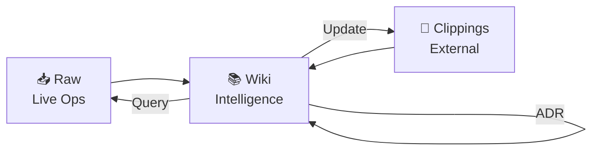

# 🌌 Agentic OS & Mind Hub (Template)

> **System Body:** Hermes Agent | **System Mind:** Obsidian Vault
> **Template Version:** 1.0 | **Architecture:** Three-Drawer System

---

## 🧭 Navigation — Maps of Content (MOCs)

| Domain | Description | Main Hub Link |
| :--- | :--- | :--- |
| 🧬 **Core** | Identity, preferences, memory palace, boundaries | `[[Core/MOC-Core]]` |
| ⚡ **Ops** | Hermes config, skills registry, automation, deployment | `[[Ops/MOC-Ops]]` |
| 🎯 **Projects** | Active sprints, goals, blockers | `[[Projects/MOC-Projects]]` |
| 📚 **Domains** | Knowledge areas: AI/ML, Software, Creative | `[[Domains/MOC-Domains]]` |
| 📊 **Tracking** | Daily notes, metrics, weekly reviews, graph analytics | `[[Tracking/MOC-Tracking]]` |
| 💬 **Chats** | Session logs, decisions, context per conversation | `[[Chats/MOC-Chats]]` |
| 🛠️ **Skills** | All installed agent skills, categorized | `[[Ops/Skills-Registry/Catalog]]` |
| ⚙️ **Config** | Live Hermes config: model, provider, TTS, gateway, cron | `[[Ops/Hermes-Config/Active-Configuration]]` |
| 📥 **Raw** | Live operations: configs, cron, skills, gateway, sessions | `[[Raw/Home]]` |
| 📎 **Clippings** | External knowledge: YouTube, articles, papers, gateway msgs | `[[Clippings/Home]]` |
| 📚 **Wiki** | Synthesized intelligence: patterns, decisions, troubleshooting | `[[Wiki/Home]]` |

---

## ⚡ Quick System Control

- **Active User Profile:** `[[Core/Identity/User-Profile]]`
- **Live Configuration:** `[[Ops/Hermes-Config/Active-Configuration]]`
- **Skills Catalog:** `[[Ops/Skills-Registry/Catalog]]`
- **Today's Note:** `[[Tracking/Daily/YYYY-MM-DD]]`
- **Raw Ops:** `[[Raw/Home]]`
- **Knowledge Inbox:** `[[Clippings/Home]]`
- **Wiki (Intelligence):** `[[Wiki/Home]]`

---

## 🔄 Three-Drawer Knowledge Loop



> **Raw** → What's running now | **Clippings** → What I captured | **Wiki** → What I know

---

## 📈 Mind Graph Status

```dataview
TABLE file.mtime AS "Last Modified", file.tags AS "Tags"
FROM ""
SORT file.mtime DESC
LIMIT 10
```