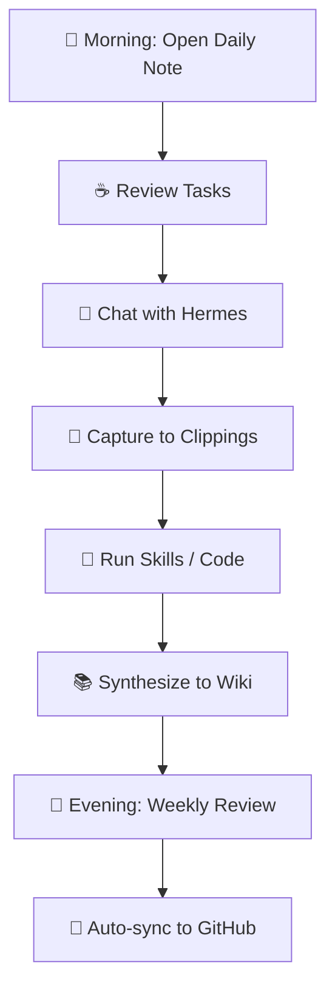

# 🌌 Hermes-Premade — Agentic OS Template

> **A complete, privacy-safe Obsidian vault template for Hermes Agent** — Three-drawer architecture, 94 skills, zero private data.

[](https://obsidian.md)
[](https://github.com/NousResearch/hermes-agent)
[](https://www.microsoft.com/windows)
[](LICENSE)

---

## 📖 Overview

**Hermes-Premade** is a production-ready Obsidian vault template that implements the **Three-Drawer Knowledge Architecture** (Raw → Clippings → Wiki) for use with **Hermes Agent** — the local-first AI agent framework by Nous Research.

### ✨ What You Get

| Feature | Description |
|---------|-------------|
| 🏗️ **Three-Drawer Architecture** | Raw (live ops) → Clippings (capture) → Wiki (synthesis) |
| 🤖 **94 Skills** | Complete Hermes skill registry, categorized & linked |
| 🧠 **Core Intelligence** | Identity, Memory Palace, Preferences — all templated |
| ⚡ **Ops Dashboard** | Hermes config, cron jobs, skills, gateway health |
| 📚 **Knowledge Domains** | AI/ML, Software, Creative — with MOCs |
| 🎯 **Project Management** | Active/Incubating/Archive with sprint templates |
| 📊 **Tracking & Analytics** | Daily/Weekly/Monthly reviews, Graph analytics |
| 🔒 **Privacy-Safe** | Zero private data — all placeholders, ready to personalize |

---

## 🖥️ Supported Platforms

| Platform | Status | Notes |
|----------|--------|-------|
| **Windows 11** | ✅ Fully Supported | Primary development target |
| **Windows Server 2022/2025** | ✅ Fully Supported | Headless/service deployment |
| **Windows 10 (21H2+)** | ⚠️ Best Effort | Requires WSL2 for some skills |
| **Linux (WSL2)** | ✅ Supported | Via WSL2 on Windows |
| **macOS** | ❌ Not Tested | Path adjustments needed |

---

## 📋 Prerequisites

### 1. **Windows Requirements**

| Component | Version | Install Command |
|-----------|---------|-----------------|
| **Windows 11** | 22H2+ (Build 22621+) | — |
| **Windows Server** | 2022 Datacenter / 2025 | — |
| **PowerShell** | 7.4+ | `winget install Microsoft.PowerShell` |
| **Git for Windows** | 2.45+ | `winget install Git.Git` |
| **Node.js** | 20 LTS (Iron) | `winget install OpenJS.NodeJS.LTS` |
| **Python** | 3.11+ | `winget install Python.Python.3.11` |
| **Obsidian** | 1.6+ | `winget install Obsidian.Obsidian` |

### 2. **Hermes Agent**

```bash
# Install Hermes (choose one)

# Option A: Via pip (recommended)
pip install hermes-agent

# Option B: From source
git clone https://github.com/NousResearch/hermes-agent
cd hermes-agent && pip install -e .

# Verify
hermes --version
```

### 3. **Obsidian Plugins (Required)**

Install these **Community Plugins** in Obsidian:

| Plugin | Purpose | Settings |
|--------|---------|----------|
| **Dataview** | Query vault as database | Enable JavaScript queries |
| **Templater** | Advanced templates | Set template folder to `Templates/` |
| **Calendar** | Daily notes navigation | Set daily note folder to `Tracking/Daily/` |
| **Periodic Notes** | Auto-create daily/weekly/monthly | Configure all three periods |
| **Graph Analysis** | Graph metrics & centrality | — |
| **Kanban** | Project boards | — |
| **QuickAdd** | Capture to Clippings | Configure capture templates |

### 4. **Optional but Recommended**

| Tool | Purpose | Install |
|------|---------|---------|
| **Windows Terminal** | Modern terminal | `winget install Microsoft.WindowsTerminal` |
| **VS Code** | Skill development | `winget install Microsoft.VisualStudioCode` |
| **Docker Desktop** | Containerized skills (ComfyUI, etc.) | `winget install Docker.DockerDesktop` |
| **FFmpeg** | Media skills (ASCII video, etc.) | `winget install Gyan.FFmpeg` |
| **Tesseract OCR** | Screen OCR skill | `winget install UB-Mannheim.TesseractOCR` |

---

## 🚀 Installation

### Step 1: Clone the Template

```powershell
# Choose your vault location
$vaultPath = "C:\Users\$env:USERNAME\Documents\Obsidian Vault\My-Agent-Mind"

git clone https://github.com/Soham1076/Hermes-Premade-.git "$vaultPath"
cd "$vaultPath"
```

### Step 2: Open in Obsidian

1. Launch **Obsidian**
2. Click **"Open folder as vault"**
3. Select `$vaultPath`
4. **Trust the vault** when prompted (required for Dataview JS)

### Step 3: Enable Community Plugins

1. Settings → **Community Plugins** → Turn on **Safe Mode: OFF**
2. Install plugins from table above
3. Enable each plugin after install

### Step 4: Configure Periodic Notes

```
Settings → Periodic Notes → Configure:
  📅 Daily Notes:
    - Folder: Tracking/Daily
    - Template: Templates/Daily-Note.md (create from Tracking/Daily/MOC-Daily.md)
    - Date format: YYYY-MM-DD
  
  📅 Weekly Notes:
    - Folder: Tracking/Weekly
    - Template: Templates/Weekly-Review.md (create from Tracking/Weekly/MOC-Weekly.md)
  
  📅 Monthly Notes:
    - Folder: Tracking/Monthly
    - Template: Templates/Monthly-Review.md (create from Tracking/Monthly/MOC-Monthly.md)
```

### Step 5: Personalize the Template

**Replace all placeholders** (search for `[` in vault):

| Placeholder | Replace With |
|-------------|--------------|
| `[USER_NAME]` | Your name/nickname |
| `[username]` | Your system username |
| `[PROFILE_NAME]` | Your Hermes profile name |
| `[PROFILE]` | `default` or your profile |
| `[HERMES_HOME]` | `%USERPROFILE%\AppData\Local\hermes\profiles\[PROFILE]` |
| `[VAULT_PATH]` | Full path to this vault |
| `[USER_HOME]` | `%USERPROFILE%` |
| `[APPDATA]` | `%APPDATA%` |
| `[N]` | Actual counts after running `skills_list()` |

**Key files to personalize first:**
- `Core/Identity/User-Profile.md` — Your identity
- `Core/Identity/Persona-Config.md` — AI personality
- `Core/Preferences/Workflow-Prefs.md` — Your workflow
- `Ops/Hermes-Config/Active-Configuration.md` — Your model/provider

### Step 6: Initialize Hermes

```powershell
# Create Hermes profile (matches vault)
hermes profile create My-Agent-Mind

# Set your model (example)
hermes model set nvidia/nemotron-3.5-lightning-30b-a3b --provider nvidia

# Configure TTS
hermes config set tts.provider piper
hermes config set tts.piper.voice en_US-amy-low

# Start gateway (Discord/Telegram/Slack)
hermes gateway start

# Verify
hermes gateway status
```

### Step 7: Set Up Auto-Sync (Cron)

```powershell
# Add daily GitHub backup (runs at 3 AM)
hermes cron create "0 3 * * *" "
  cd '$vaultPath' &&
  git add -A &&
  git commit -m \"Auto-sync \$(date +%F %H:%M)\" &&
  git push
" --name "github-vault-backup" --no-agent

# Add hourly vault sync (updates catalog, config, daily notes)
hermes cron create "0 * * * *" "
  hermes skill run obsidian --vault-path '$vaultPath'
" --name "obsidian-vault-sync" --skill obsidian
```

---

## 🪟 Windows Server Deployment (Headless)

### As a Windows Service

```powershell
# Install NSSM (Non-Sucking Service Manager)
winget install nssm

# Create service for Hermes Gateway
nssm install HermesGateway
nssm set HermesGateway Application "C:\Users\$env:USERNAME\.local\bin\hermes.exe"
nssm set HermesGateway AppParameters "gateway start"
nssm set HermesGateway AppDirectory "C:\Users\$env:USERNAME"
nssm set HermesGateway Start SERVICE_AUTO_START
nssm set HermesGateway Description "Hermes Agent Gateway (Discord/Telegram/Slack)"
nssm start HermesGateway
```

### Scheduled Tasks (Alternative to Cron)

```powershell
# Daily backup at 3 AM
$action = New-ScheduledTaskAction -Execute 'powershell.exe' -Argument "
  cd '$vaultPath'; git add -A; git commit -m 'Auto-sync $(date +%F)'; git push
"
$trigger = New-ScheduledTaskTrigger -Daily -At 3am
Register-ScheduledTask -TaskName "Hermes-Vault-Backup" -Action $action -Trigger $trigger -RunLevel Highest

# Hourly vault sync
$action2 = New-ScheduledTaskAction -Execute 'hermes.exe' -Argument "skill run obsidian --vault-path '$vaultPath'"
$trigger2 = New-ScheduledTaskTrigger -Once -At (Get-Date).Date.AddHours(1) -RepetitionInterval (New-TimeSpan -Hours 1) -RepetitionDuration ([TimeSpan]::MaxValue)
Register-ScheduledTask -TaskName "Hermes-Vault-Sync" -Action $action2 -Trigger $trigger2 -RunLevel Highest
```

### Firewall Rules (for Gateway)

```powershell
# Allow Hermes Gateway ports (adjust as needed)
New-NetFirewallRule -DisplayName "Hermes Gateway Discord" -Direction Inbound -Protocol TCP -LocalPort 443 -Action Allow
New-NetFirewallRule -DisplayName "Hermes Gateway Telegram" -Direction Inbound -Protocol TCP -LocalPort 443,80,8443 -Action Allow
New-NetFirewallRule -DisplayName "Hermes Gateway Slack" -Direction Inbound -Protocol TCP -LocalPort 443 -Action Allow
```

---

## 📁 Vault Structure

```
My-Agent-Mind/
├── Home.md                              # 🏠 Dashboard (start here)
├── .gitignore                           # Git ignore rules
├── 📥 Raw/                              # Drawer 1: Live Operations
│   ├── Home.md
│   ├── Hermes-Config/                   # Model, TTS, Vision, Gateway, Tools
│   ├── Cron-Jobs/                       # Scheduled jobs & status
│   ├── Skills-Registry/                 # Installed skills index
│   ├── Daily-Ops/                       # Gateway health, API limits
│   └── Session-Context/                 # Current tasks, open loops
├── 📎 Clippings/                        # Drawer 2: External Knowledge
│   ├── Home.md
│   ├── YouTube/                         # Video transcripts & notes
│   ├── Articles/                        # Web articles & blogs
│   ├── Papers/                          # Research papers
│   ├── Discord-Telegram/                # Gateway messages
│   ├── Tools/                           # Tool references
│   └── Unprocessed/                     # Inbox for triage
├── 📚 Wiki/                             # Drawer 3: Synthesized Intelligence
│   ├── Home.md
│   ├── Patterns/                        # Discovered patterns
│   ├── Decisions/                       # ADRs (Architecture Decision Records)
│   ├── Troubleshooting/                 # Fixes & workarounds
│   ├── Operations/                      # Runbooks & procedures
│   ├── Integrations/                    # External service docs
│   └── Meta/                            # Vault maintenance
├── Core/                                # Identity & Preferences
│   ├── Identity/                        # User profile, persona
│   ├── Memory-Palace/                   # Long-term memory
│   └── Preferences/                     # Workflow settings
├── Ops/                                 # Operations
│   ├── Hermes-Config/                   # Live config
│   └── Skills-Registry/                 # 94 skills by category
├── Domains/                             # Knowledge Areas
│   ├── AI-ML/
│   ├── Software/
│   └── Creative/
├── Projects/                            # Project Management
│   ├── Active/                          # Current sprints
│   ├── Incubating/                      # Ideas & proposals
│   └── Archive/                         # Completed
├── Tracking/                            # Analytics
│   ├── Daily/                           # Daily notes
│   ├── Weekly/                          # Sprint reviews
│   ├── Monthly/                         # Monthly planning
│   ├── Metrics/                         # Skill velocity, health
│   └── Graph-Analytics/                 # Graph health reports
├── Chats/                               # Session logs
├── Tags/                                # Taxonomy
└── Templates/                           # Note templates
```

---

## 🔧 Configuration Reference

### Hermes Config (`Ops/Hermes-Config/Active-Configuration.md`)

```yaml
model: "nvidia/nemotron-3.5-lightning-30b-a3b"
provider: "nvidia"
base_url: "https://integrate.api.nvidia.com/v1"

tts:
  provider: "piper"
  piper:
    voice: "en_US-amy-low"
    speed: 1.0

vision:
  provider: "google-ai-studio"

gateway:
  platforms: ["discord", "telegram", "slack"]
  telegram_polling: true
```

### Environment Variables (`.env` — **NOT COMMITTED**)

```bash
# Required for skills
ANTHROPIC_API_KEY=sk-ant-...          # For Claude Code
OPENAI_API_KEY=sk-...                 # For Codex, OpenAI skills
ELEVENLABS_API_KEY=...                # For TTS
GEMINI_API_KEY=...                    # For Gemini TTS/Vision

# Gateway (one per platform)
DISCORD_TOKEN=...
TELEGRAM_BOT_TOKEN=...
SLACK_BOT_TOKEN=...
SLACK_APP_TOKEN=...

# Allow all Telegram users (or set ALLOWED_USERS)
TELEGRAM_ALLOW_ALL=true
```

---

## 🛠️ Skills Quick Reference

### By Category (94 Total)

| Category | Skills | Key Skills |
|----------|--------|------------|
| **Autonomous AI Agents** | 8 | `claude-code`, `codex`, `computer-use`, `hermes-agent`, `opencode` |
| **Creative** | 17 | `comfyui`, `manim-video`, `p5js`, `excalidraw`, `architecture-diagram` |
| **Productivity** | 15 | `notion`, `google-workspace`, `docx`, `xlsx`, `pdf`, `airtable` |
| **Software Dev** | 13 | `github-*`, `test-driven-development`, `systematic-debugging`, `plan` |
| **Research** | 7 | `arxiv`, `grounded-citations`, `polymarket`, `llm-wiki` |
| **MLOps** | 3 | `llama-cpp`, `huggingface-hub`, `serving-llms-vllm` |
| **Desktop** | 6 | `netflix-*`, `windows-desktop-automation`, `roblox-desktop-automation` |
| **GitHub** | 7 | `github-auth`, `github-pr-workflow`, `github-code-review` |
| **Other** | 25 | `email`, `media`, `smart-home`, `note-taking`, etc. |

**List all:** `hermes skills list` or run `skills_list()` in Hermes.

---

## 🔄 Daily Workflow



### Key Commands

| Action | Command |
|--------|---------|
| New daily note | `Ctrl+N` in `Tracking/Daily/` (or Calendar plugin) |
| Capture to Clippings | QuickAdd → "Clippings Capture" |
| Run skill | `hermes skill run <skill-name>` |
| Check gateway | `hermes gateway status` |
| View cron jobs | `hermes cron list` |
| Sync vault | `hermes skill run obsidian` |
| Manual backup | `cd vault && git add -A && git commit -m "Sync" && git push` |

---

## 🐛 Troubleshooting

### Common Issues

| Issue | Solution |
|-------|----------|
| **Dataview queries not rendering** | Enable "JavaScript Queries" in Dataview settings |
| **Templater not finding templates** | Set template folder to `Templates/` in Templater settings |
| **Hermes command not found** | Add `~/.local/bin` to PATH: `$env:PATH += ";$env:USERPROFILE\.local\bin"` |
| **Gateway won't start** | Check `hermes gateway status` → kill zombie processes → restart |
| **Cron jobs not running** | Verify `hermes cron list` → check logs in `%LOCALAPPDATA%\hermes\profiles\[PROFILE]\cron\output\` |
| **Skills not loading** | Run `hermes skills reload` or restart Hermes desktop |
| **Git push fails (credential-manager)** | `git config --global credential.helper manager-core` |

### Log Locations

| Log | Path |
|-----|------|
| Hermes Agent | `%LOCALAPPDATA%\hermes\profiles\[PROFILE]\logs\agent.log` |
| Gateway | `%LOCALAPPDATA%\hermes\profiles\[PROFILE]\logs\gateway.log` |
| Cron Output | `%LOCALAPPDATA%\hermes\profiles\[PROFILE]\cron\output\[JOB_ID]\` |
| Skill Errors | `%LOCALAPPDATA%\hermes\profiles\[PROFILE]\skills\[SKILL]\logs\` |

---

## 🔐 Security Notes

- **Never commit** `.env`, `config.yaml` with real keys, or `memories/` with real data
- **Use `.gitignore`** — already configured for Obsidian + Hermes
- **Rotate tokens** periodically (Discord, Telegram, Slack, API keys)
- **Restrict Telegram** with `ALLOWED_USERS` in `.env`
- **Run gateway as service** on Server for persistence

---

## 📚 Resources

| Resource | Link |
|----------|------|
| Hermes Agent Docs | https://hermes-agent.nousresearch.com/docs |
| Hermes GitHub | https://github.com/NousResearch/hermes-agent |
| Obsidian Help | https://help.obsidian.md |
| Dataview Docs | https://blacksmithgu.github.io/obsidian-dataview/ |
| Three-Drawer Method | [Video Reference](https://youtu.be/s0ulILUmosw) |

---

## 🤝 Contributing

This is a **template repository** — fork and customize for your own use.

To suggest improvements to the template structure:
1. Fork this repo
2. Make changes (keeping placeholders generic)
3. Submit PR with clear description

---

## 📄 License

MIT License — Free for personal and commercial use.

**Attribution appreciated:** "Based on Hermes-Premade by Soham1076"

---

## 🙏 Acknowledgments

- **Nous Research** — Hermes Agent framework
- **Obsidian Team** — The best PKM tool
- **Skill Authors** — All 94 skill contributors
- **Three-Drawer Method** — Inspired by [Second Brain / PARA / Zettelkasten synthesis](https://youtu.be/s0ulILUmosw)

---

> **Start here:** Open `Home.md` in Obsidian → Read → Personalize → Run `hermes` → Build your agentic mind. 🧠✨